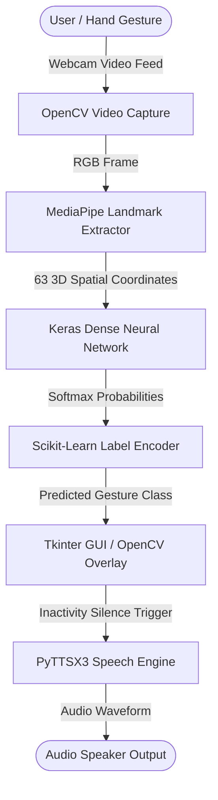
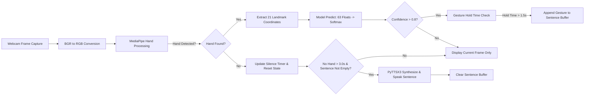
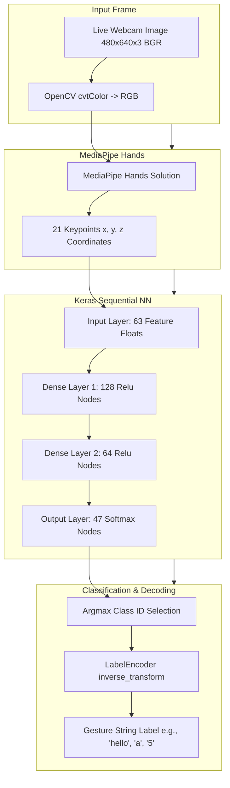
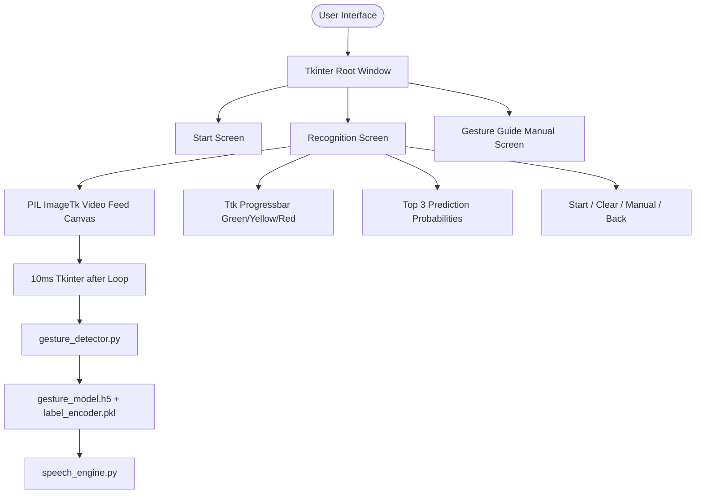
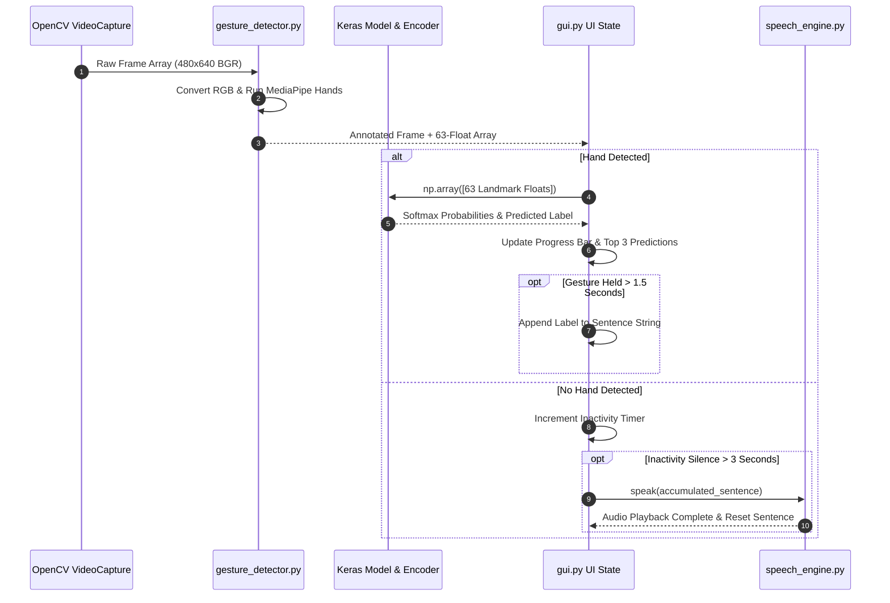
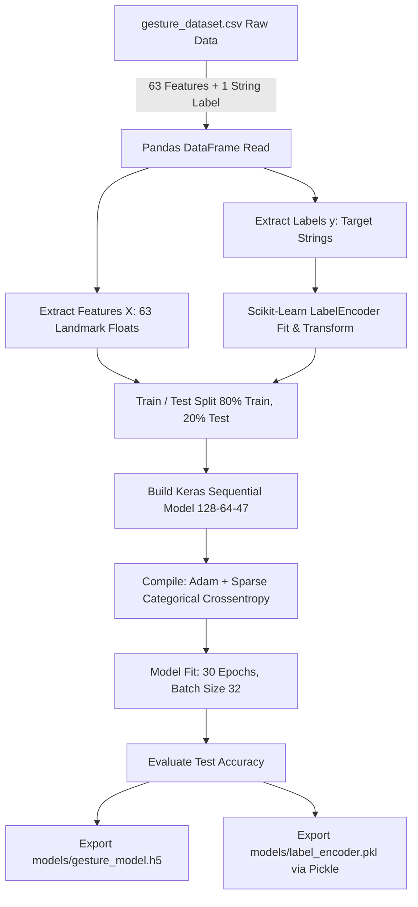
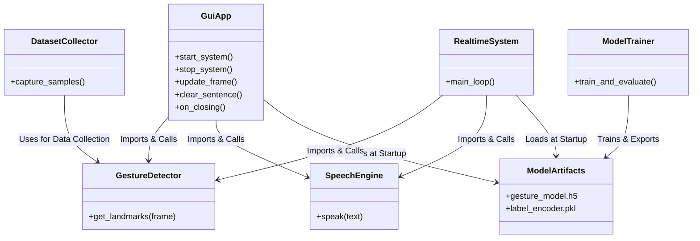

# GestureVoiceAI — System Architecture

## 1. System Overview

**GestureVoiceAI** is an end-to-end computer vision and speech AI system designed to bridge sign language communication gaps. It captures live video frames via webcam, extracts 21 3D hand landmark spatial coordinates `(x, y, z)` using MediaPipe Hands, classifies hand gestures across 47 target categories using a custom Keras Deep Neural Network, and synthesizes completed phrase sequences into spoken audio using PyTTSX3.

---

## 2. High-Level Architecture

---

## 3. End-to-End Workflow

---

## 4. ML / AI Pipeline

### Model Architecture Specification
- **Input Shape:** `(63,)` vector containing 21 MediaPipe hand keypoints `(x, y, z)`.
- **Layer 1:** Fully Connected `Dense(128, activation='relu')`.
- **Layer 2:** Fully Connected `Dense(64, activation='relu')`.
- **Output Layer:** Fully Connected `Dense(47, activation='softmax')`.
- **Loss Function:** `sparse_categorical_crossentropy`.
- **Optimizer:** `adam`.

---

## 5. Application / UI Architecture

---

## 6. Data Flow

---

## 7. Training Pipeline

---

## 8. Technology Stack

| Category | Technology |
| :--- | :--- |
| **Language** | Python 3.10 |
| **Deep Learning Framework** | TensorFlow / Keras (v2.10.0) |
| **Hand Tracking / Landmark Extraction** | MediaPipe Hands (v0.10.9) |
| **Computer Vision & Image Processing** | OpenCV (`opencv-python` v4.6.0) |
| **User Interface Framework** | Tkinter & PIL (`Pillow` v9.5.0) |
| **Speech Synthesis (TTS)** | PyTTSX3 (v2.90) |
| **Data Processing & ML Utilities** | NumPy (v1.23.5), Pandas (v1.5.0), Scikit-Learn (v1.1.3) |
| **Model Serialization Format** | HDF5 (`.h5`) & Pickle (`.pkl`) |

---

## 9. Component Relationships

---

## 10. Complete Architecture Summary

The GestureVoiceAI system provides a complete real-time sign-language recognition and speech generation solution. Live webcam frames are ingested by OpenCV and converted to RGB space before passing to MediaPipe Hands, which extracts 21 keypoint 3D spatial coordinates `(x, y, z)`. The resulting 63-element feature vector is fed into a trained 3-layer Keras Dense Neural Network to compute softmax class probabilities across 47 hand gesture categories. A Scikit-Learn LabelEncoder resolves the predicted index to its target text string. The Tkinter GUI tracks gesture stability over a 1.5-second hold threshold to construct sentences, and after 3 seconds of hand inactivity, the PyTTSX3 speech engine speaks the accumulated sentence aloud before resetting state.
